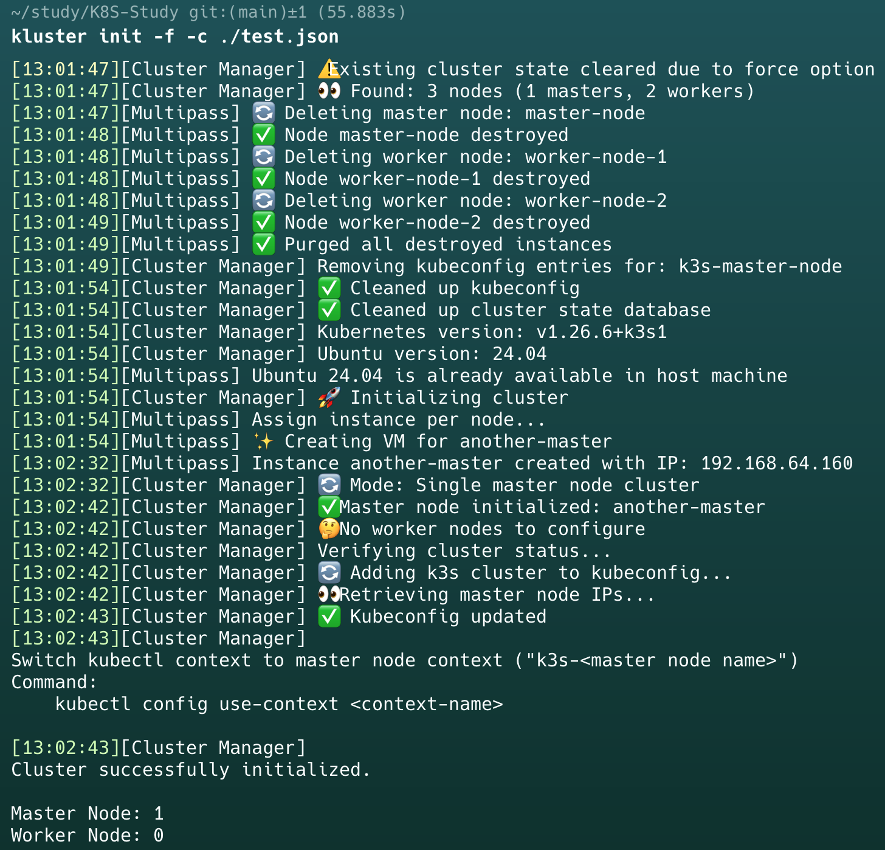

# K3S Local Cluster CLI

MacOS에서만 사용이 가능한 로컬 Kubernetes 클러스터 관리 도구입니다. 별도의 Python 패키지 설치가 필요 없는 0 dependencies 도구입니다.

> **⚠️ 주의사항**: 이 CLI는 운영환경을 위한 도구가 아니며, 로컬 PC에서 멀티 노드 클러스터 환경 구축을 위한 개발/테스트 목적으로만 사용해주세요.

## 필수 요구사항

`-h`, `-v` 외의 모든 명령어에서 다음 도구들에 대한 dependency 검사가 실행됩니다:

- [`multipass`](https://canonical.com/multipass): 필수
- [`kubectl`](https://kubernetes.io/ko/docs/reference/kubectl/): 필수
- [`helm`](https://helm.sh/): 필수 x

```
[23:04:43][Cluster Manager] ❌ kubectl
[23:04:43][Cluster Manager] ❌ multipass
[23:04:43][Cluster Manager] ❌ helm (Not Required)
```

## Commands

### Installation

```bash
./setup.sh
```

### Base Command

- **도움말**: `-h`, `--help`

  ```bash
  kluster -h
  ```

- **버전 확인**: `-v`, `--version`
  ```bash
  kluster -v
  ```

### Cluster Command

- **클러스터 초기화**: `init`

  ```bash
  kluster init [옵션]
  ```

  - 옵션:
    - `--force`, `-f`: 기존 클러스터가 있으면 삭제 후 재생성

- **클러스터 정보 조회**: `view`

  ```bash
  kluster view
  ```

- **클러스터 config 수정**: `config`

  ```
  kluster config [sub command]
  ```

  - 서브커맨드
    - `edit`: cluster-config.json 파일을 vim으로 열음

- **특정 노드 VM Shell 접속**: `shell`

  ```bash
  kluster shell --node <노드이름>
  ```

  - 옵션:
    - `--node`, `-n`: 접속할 노드 이름 (필수)

- **필수 의존성 검사(`multipass`,`kubectl`,`helm`)**: `doctor`

  ```bash
  kluster doctor
  ```

- **클러스터 삭제**: `destroy`
  ```bash
  kluster destroy [옵션]
  ```
  - 옵션:
    - `--force`, `-f`: 삭제 확인 생략

## Cluster Configuration

클러스터 정의를 위한 JSON 형식의 설정 파일이 필요합니다. 클러스터는 다음 두 가지 형태로 구성할 수 있습니다:

1. **Single Node Cluster**: Master 노드가 1개인 경우
2. **High Availability Cluster**: Master 노드가 2개 이상인 경우

### Config file example

> **⚠️ 해당 프로젝트에는 기본 클러스터 정의가 포함되어있습니다.(`cluster-config.json`) 해당 파일은 아래 설명과 관련없음을 주의해주시기 바랍니다.**

```json
{
  "k3s_version": "v1.26.6+k3s1",
  "ubuntu_version": "24.04",
  "nodes": {
    "master-node-1": {
      "type": "master",
      "cpu": 2,
      "memory": 2048,
      "disk": 10
    },
    "master-node-2": {
      "type": "master",
      "cpu": 2,
      "memory": 2048,
      "disk": 10
    },
    "worker-node": {
      "type": "worker",
      "cpu": 2,
      "memory": 2048,
      "disk": 10
    }
  }
}
```

### Config File

#### 1. `k3s_version`

- 각 노드에 설치될 k3s 버전
- [k3s 릴리즈 페이지](https://github.com/k3s-io/k3s/releases)에서 버전 확인 가능

#### 2. `ubuntu_version`

- Multipass VM에 사용될 Ubuntu 버전
- 지원 버전 확인:
  ```bash
  multipass find
  ```

#### 3. `nodes`

- 클러스터의 각 노드 정의
- 구조: `{"노드이름": {"노드설정"}}`

#### 노드 설정 필드

- **`type`**:

  - 노드 유형: `master` 또는 `worker`
  - 최소 1개 이상의 `master` 노드 필요

- **`cpu`**:

  - 노드에 할당할 CPU 코어 수
  - 기본값: master(2), worker(1)

- **`memory`**:

  - 노드 메모리 할당량(MB)
  - 기본값: master(2048), worker(1024)

- **`disk`**:
  - 노드 디스크 용량(GB)
  - 기본값: 10

## ⚠️ 생성된 Cluster에 대해서는 context가 생성됩니다.

클러스터 `init` 시 kubeconfig(`~/.kube/config`)에 각 마스터 노드에 대한 context가 생성됩니다.

상단 예시 설정 파일로 클러스터를 생성하면 `k3s-master-node-1`,`k3s-master-node-2`라는 이름의 context가 생성됩니다.

즉, 마스터 노드에 대한 context는 각각 생성되는겁니다.

```bash
kubectl config use-context k3s-<master node name>
```

`destroy` 명령어로 클러스터 삭제시 `init` 과정에서 생성된 context도 모두 삭제됩니다.

## Running Example

<div style="display:flex">
  
</div>
